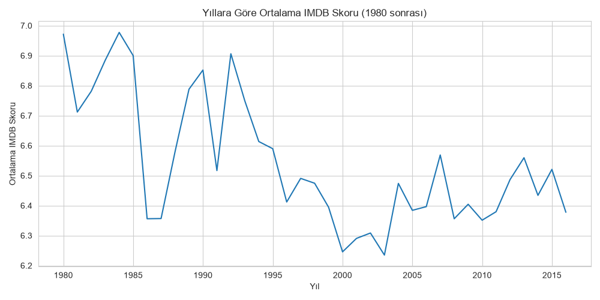
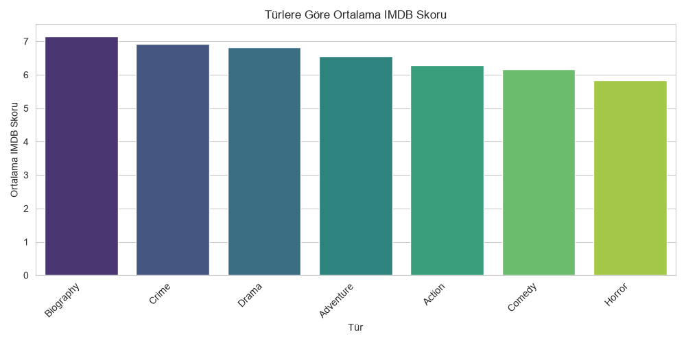
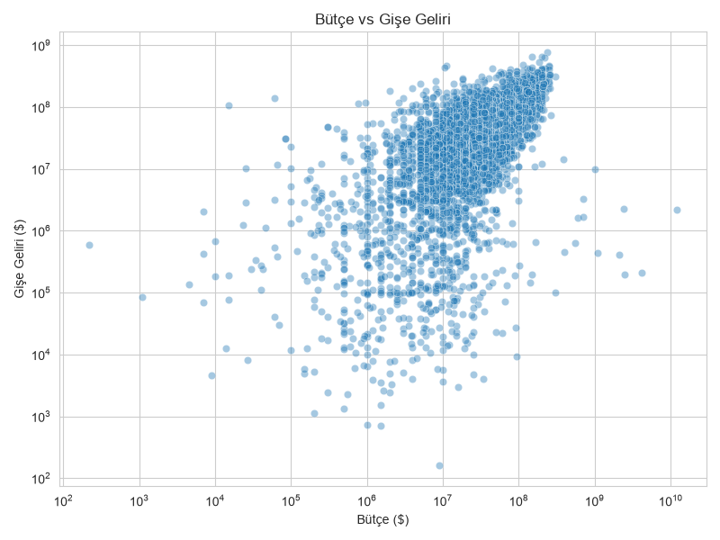
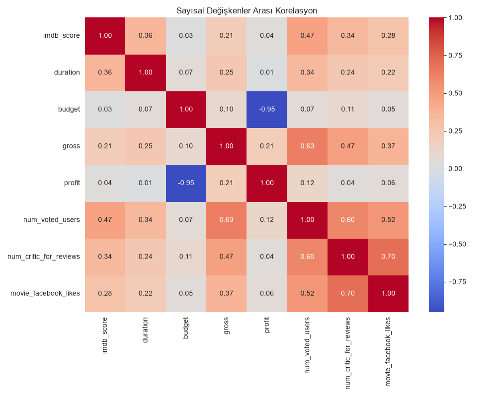

# Film Veri Analizi (IMDB 5000 Movie Dataset)

Bu proje, IMDB'den derlenen ~5000 filmlik veri seti üzerinde yapılan keşifçi veri analizini (EDA) içerir. Pandas ile veri temizleme, gruplama ve istatistiksel özetler; Matplotlib/Seaborn ile görselleştirmeler yapılmıştır.

## Kullanılan Kütüphaneler

- pandas
- matplotlib
- seaborn

## Veri Seti

`movie_metadata.csv` — 28 sütun, ~5000 film. Önemli sütunlar:

- `movie_title`, `director_name`, `genres`, `title_year`
- `budget`, `gross`, `imdb_score`
- `num_voted_users`, `num_critic_for_reviews`, `movie_facebook_likes`

## Yapılan Analizler

1. **Veri Temizleme**: Tekrarlanan satırların kaldırılması, eksik değerlerin (`budget`, `gross`, `imdb_score`, `title_year`) filtrelenmesi, ana türün (`main_genre`) ve kâr (`profit = gross - budget`) hesaplanması.
2. **Genel İstatistikler**: IMDB skor dağılımı, yıllara göre film sayısı.
3. **Tür Analizi**: En yaygın türler ve türlere göre ortalama IMDB skoru (en az 50 film içeren türler).
4. **En İyi Filmler / Yönetmenler**: IMDB skoruna göre ilk 10 film, en kârlı 10 film, en az 5 film çekmiş yönetmenler arasında en yüksek ortalama skora sahip olanlar.
5. **Görselleştirmeler**:
   - Yıllara göre ortalama IMDB skoru trendi
   - Türlere göre ortalama IMDB skoru
   - Bütçe vs gişe geliri (log-log scatter plot)
   - Sayısal değişkenler arası korelasyon ısı haritası

## Önemli Bulgular

- **En yüksek ortalama skora sahip yönetmenler**: Christopher Nolan (8.43), Quentin Tarantino (8.20), James Cameron (7.91)
- **En kârlı filmler**: Avatar, Jurassic World, Titanic
- **Tür bazında ortalama IMDB skoru**: Biography ve Crime, Drama gibi türler Action/Comedy/Horror'a göre ortalamada daha yüksek puan alıyor
- **Bütçe ile gişe geliri arasında pozitif bir ilişki** var, ancak yüksek bütçe her zaman yüksek gelir garantisi değil

## Görseller






## Çalıştırma

```bash
pip install pandas matplotlib seaborn
python analiz.py
```
